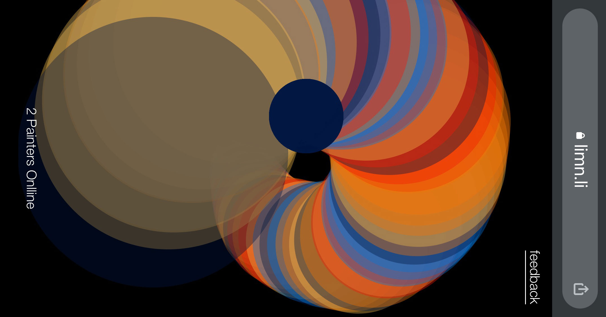

# dots.party

### https://dots.party/

dots.party is a collaborative drawing application. Users connect to a shared canvas via websockets where they place primitive shapes (currently circles) on that canvas. A circle placed on one user's screen immediately shows up on all users' screens.

The original dates back to 2015 when I installed it at the TBD music festival in Sacramento. I've dusted this off and updated it, breaking it out at various times in various settings.

In the context of events, I typically project a browser screen with dots.party running. People hit a QR code to connect to the app then start interacting with what's on the projector screen and the screens of everybody playing with them.

 

## Tools and Technologies

https://p5js.org/ + https://nextjs.org/ + https://socket.io/

 

In progress is the integration of Supabase to have persistent data when a player launches the app. Currently they enter onto a blank canvas, and are typically confused as to what to do.

https://supabase.com/

 

Additionally I'm working with React Native + Expo to flesh out a proper mobile app.

https://expo.dev/

   
