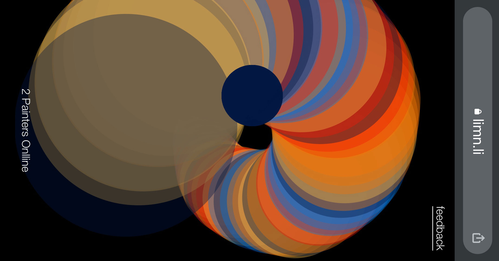

# dots.party

# https://dots.party/

dots.party is a collaborative drawing application. Users connect to a shared canvas via websockets where they place primitive shapes (currently circles) on that canvas. A circle placed on one user's screen immediately shows up on all users' screens.

The original dates back to 2015 when I installed it at the TBD music festival in Sacramento. I've dusted this off and updated it, breaking it out at various times in various settings.

In the context of events, I typically project a browser screen with dots.party running. People hit a QR code to connect to the app then start interacting with what's on the projector screen and the screens of everybody playing with them.

 

# Tools and Technologies

### [p5.js](https://p5js.org/) &middot; [Next.js](https://nextjs.org/) &middot; [WebSockets](https://supabase.com/realtime)

 

I've leveraged [WebSockets in Supabase Realtime](https://supabase.com/realtime) to enable users' activity on their devices to be replicated on all other connected devices instantaneously ... or close to it.

Unfortunately storing and immediately broadcasting that same data seems a bit daunting. Early experiments have been slow, clunky, go out for a smoke while it's drawn to the screen. More experimentation to do here.

 

Eventually I'll look to work with React Native to flesh out a proper mobile app.

   
